# E-Commerce Cohort & Retention Analysis

Cohort, RFM segmentation, and statistical analysis of a 12-month e-commerce order dataset (286K order lines / 64K customers), built in pandas + Plotly.

## 🗂️ Repository structure

```
.
├── README.md                              ← you are here
├── cohort_analiz_ədalət_sadıqov.ipynb     ← full analysis notebook
├── Charts/
│   ├── README.md                          ← chart-by-chart explanations
│   ├── 00_dashboard.png
│   └── 01–12_*.png                        ← one PNG per chart
└── data/
    ├── README.md                          ← dataset description & column dictionary
    └── sales.csv                          ← raw dataset (286,392 rows)
```

## 🔑 Key findings

1. **Retention is the core problem.** ~94% of customers never return after their first purchase (week 0 → 1 retention drops from 100% to ~6.5%).
2. **Revenue is highly concentrated.** 3 of 15 categories generate 82.3% of revenue; `Champions` (12.4% of customers) generate 44.5% of revenue.
3. **ARPU rises with lifetime** despite low retention — the small group that returns is disproportionately valuable.
4. **December 2020 was a one-off campaign spike**, not repeated organic growth — the acquisition base is otherwise thin.
5. **Payment method correlates with loyalty** (Cramér's V = 0.29, p < 0.001); geography and gender do not.
6. **Revenue is driven more by order value than order frequency** (AOV–revenue ρ = 0.94 vs. order count–revenue ρ = 0.60).

Full methodology, hypothesis tests, and business recommendations: see the Final Summary section in [`cohort_analiz_ədalət_sadıqov.ipynb`](cohort analiz_ədalət_sadıqov.ipynb).

## 🛠️ Stack

`pandas` · `numpy` · `plotly` (Express + Graph Objects + FigureWidget) · `scipy.stats` · `ipywidgets`

## ⚠️ Note on the dataset

`data/sales.csv` includes customer name/email/phone/SSN-style columns. This is a synthetic/practice dataset — see [`data/README.md`](data/README.md) for a privacy note before treating it as production data.

---

## 📊 Dashboard

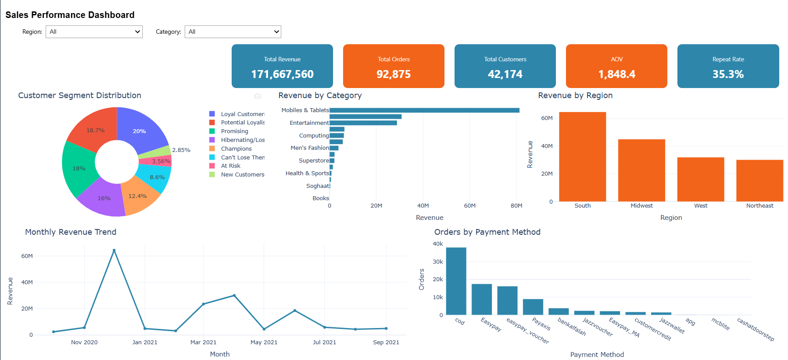

Consolidated view (unfiltered / "All" scope): total revenue, total orders, total customers, AOV, and repeat rate, alongside revenue by category, revenue by region, customer segment distribution (RFM), monthly revenue trend, and orders by payment method. Interactive in the notebook via `ipywidgets` region/category slicers — the image above is a static snapshot of the default view.

## 📈 Charts

### 01 — Monthly Unique Orders per Cohort
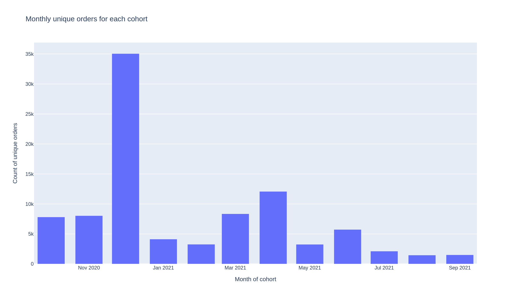

Number of unique orders placed by each monthly acquisition cohort. **2020-12 is the clear peak**, followed by a sharp drop in 2021-01/02, with a smaller secondary wave in 2021-04 and 2021-06.

### 02 — Monthly Unique Customers per Cohort
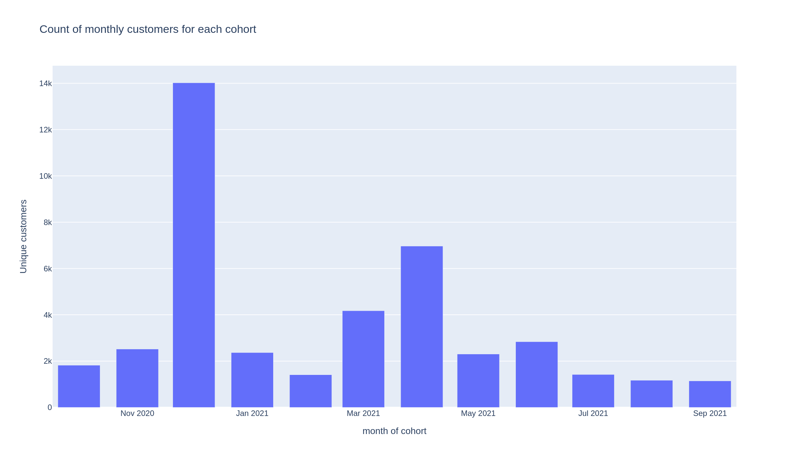

Same pattern at the customer level: the Dec-2020 cohort is 3–9x larger than any other month, pointing to a one-off seasonal campaign rather than sustained organic growth.

### 03 — Monthly Total Revenue per Cohort
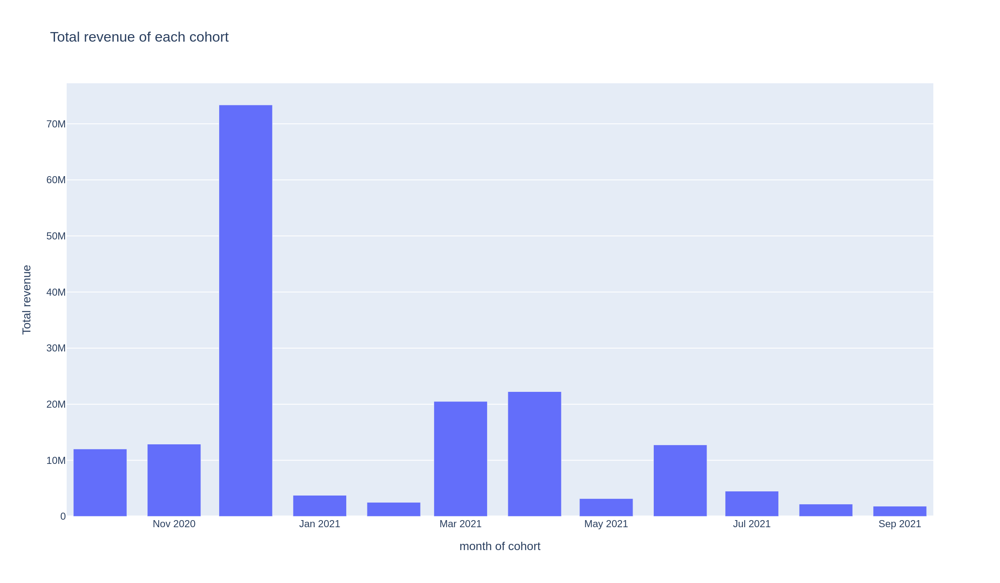

Revenue mirrors the order/customer volume pattern — confirming the Dec-2020 spike was a volume effect, not a value effect.

### 04 — ARPU Lifetime Heatmap (Monthly Cohorts)
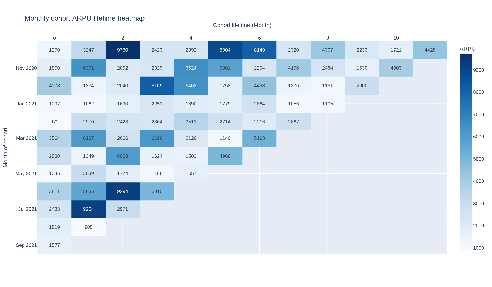

Average Revenue Per User for each cohort at each month of lifetime. ARPU tends to **rise** with lifetime despite low retention — the few customers who do return spend more per person than first-time buyers. Low retention, but high value among the retained.

### 05 — Weekly Retention Heatmap
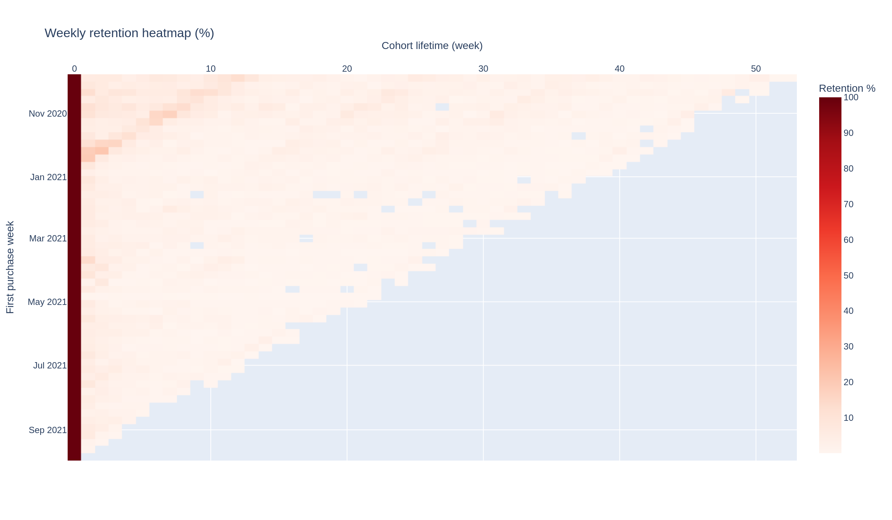

Retention rate (%) for each weekly cohort across lifetime weeks. Average retention collapses from 100% (week 0) → ~6.5% (week 1) → ~6.0% (week 2) — roughly 94% of customers never return after their first purchase.

### 06 — Weekly Churn Rate Heatmap
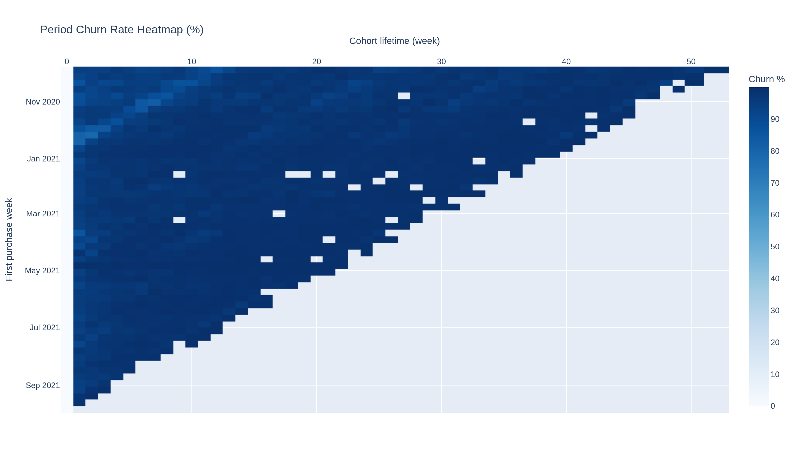

The mirror image of retention (`churn = 1 − retention`). Churn stabilizes above 90% after week 1, meaning that once a customer is lost, they almost never come back.

### 07 — Category Revenue, Colored by Repeat-Customer Rate
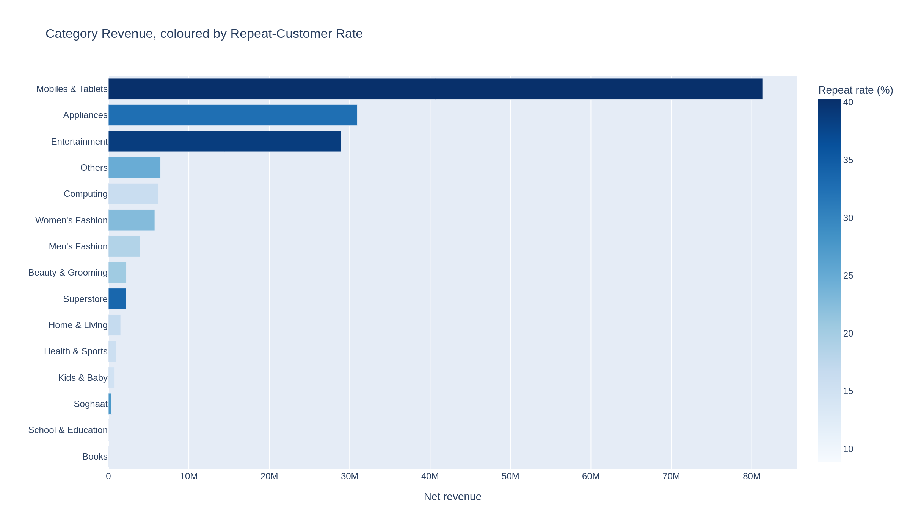

Net revenue by product category, colored by that category's repeat-purchase rate. Just 3 of 15 categories — `Mobiles & Tablets`, `Appliances`, `Entertainment` — generate 82.3% of total revenue (`Mobiles & Tablets` alone: 47.4%). `Men's Fashion` leads customer **acquisition** despite low AOV, while `Mobiles & Tablets` leads both revenue and repeat-purchase rate (40.3%).

### 08 — RFM Segment Map
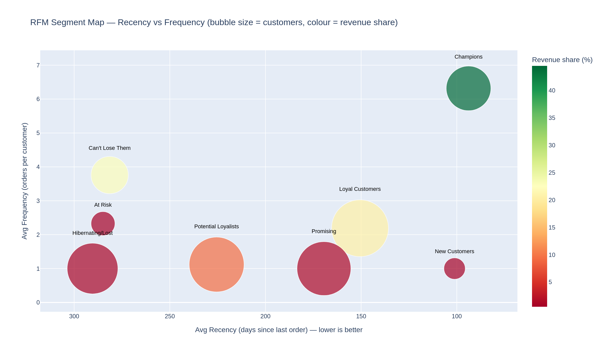

Bubble chart of customer segments (Recency vs. Frequency; bubble size = customer count; color = revenue share). `Champions` (12.4% of customers) generate 44.5% of revenue; `Champions + Can't Lose Them` (21.0% of customers) generate 67.3% of revenue. Segment size and segment value are not the same thing — `Promising` and `Hibernating/Lost` together make up over a third of customers but only 1.9% of revenue.

### 09 — Geographic Analysis (Revenue & Repeat Rate by Region)
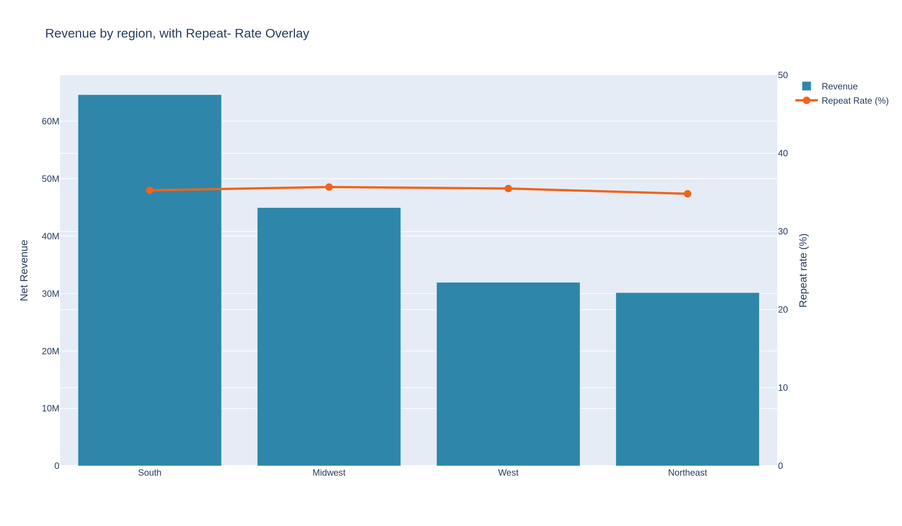

Revenue and repeat-purchase rate by region. Revenue is roughly proportional to customer base — `South` leads with 37.6% of revenue and 37.0% of customers — and AOV plus repeat rate are similar across all four regions. No meaningful region-specific behavioral difference was found; geographic targeting should be driven by market size, not assumed regional differences.

### 10 — Spearman Correlation Matrix (Customer-Level Metrics)
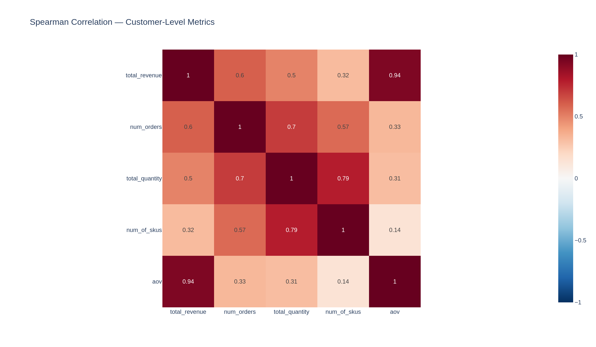

Spearman correlation across customer-level metrics (total revenue, order count, AOV, quantity, SKU diversity, etc.). AOV correlates more strongly with total revenue (ρ = 0.94) than order count does (ρ = 0.60) — revenue is driven more by how much customers spend per order than by how often they order. **Correlation does not imply causation** — these are associations within the observed data only.

### 11 — Monthly Orders and AOV
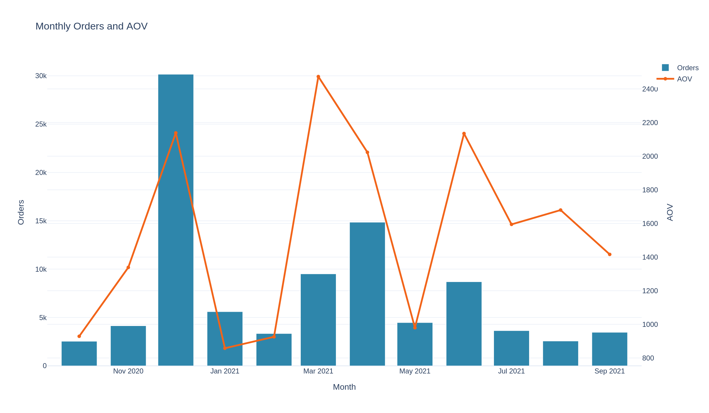

Order volume (bars) vs. average order value (line) by month, on dual axes — used to check whether volume swings were accompanied by value swings (they largely were not).

### 12 — Seasonality / Anomaly Detection
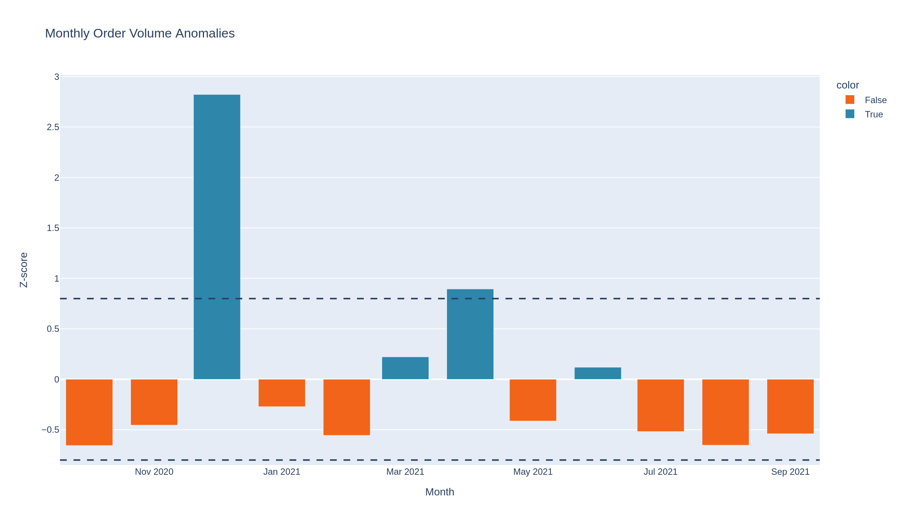

Monthly order counts flagged for anomalies using a z-score threshold (|z| > 0.8). Two months stand out: **2020-12** (z = 2.82, the campaign spike) and **2021-04** (z = 0.89, a smaller secondary wave).

---

**Ədalət Sadıqov**
[LinkedIn](https://www.linkedin.com/in/%C9%99dal%C9%99t-sad%C4%B1qov-3b6297381/)
